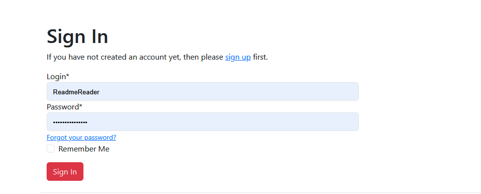
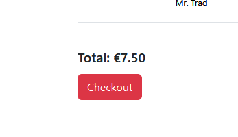
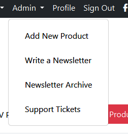
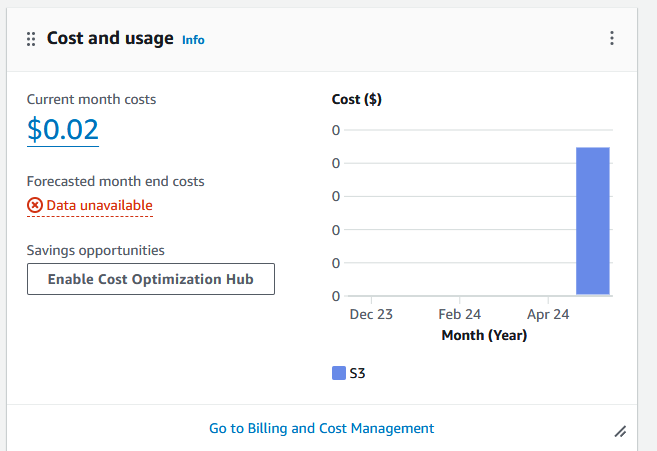
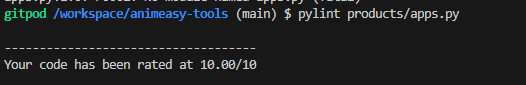

# Animeasy Tools E-commerce Site

## Overview

Animeasy is an e-commerce store that provides small software plugins for animation production. 
This README provides an overview of the ecommerce app, including its purpose, features, installation instructions, usage guidelines, and contact information.

## Purpose
The purpose of the ecommerce app is to provide users with a platform to browse, purchase, and manage digital products online. It aims to streamline the shopping experience for customers and simplify product management for sellers.
Animation is a costly and time consuming business. With the advent of digital animation it is largely created using computer programmes. This means that professionals can browse the web for plugins that may help them. 
In my animation career, I started out using plugins purchased or developed by the studio, but over time I started to develop my own for more specific uses. 

Animeasy is intended to be a B2B solution for freelancers and small studios. Animation studios never truly recovered from the pandemic, the majority of work is done remotely online now. This makes an e-commerce solution the ideal model for purchasing plugins for animation software. 

Animeasy works by digital download. Although I have not implemented digital downloads in this project (as many of the products are fake and it's more like a to-do list of products to make in the future) this model works really well. I have both purchased and sold plugins for animation over the internet before. Professionals will often Google a problem they are having and find the solution in the form of a Gumroad download or in Adobe Marketplace. 

## Features
### User authentication: Allow users to register, login, and manage their accounts.

- Users can make purchases without making an account, but they can make an account if they want to

- Returning users can log into their account 

- Users can reset their password to recover their account if they forget 
- Users can delete their account. The initial click disables the button and confirms the action, in case they clicked it by accident 

### Profiles 
- Users can view their information from their profile page 

- If no user information exists yet, the information section reads "none"

- Users can change their information from their profile page 

- User's order history is saved at the bottom of their profile 
- If the user has no order history, this is reflected back to them 

- User's support tickets and the replies can be accessed from the profile page 

### Product browsing: Enable users to search, filter, and view products.

- Users can see all products in Animeasy store in one place 

- Users can sort products by category, depending on which software they're looking for 

- Users can search for products by title or key word 

- A product detail page is available for each product 
- The product detail page displays a product description, the software category and any user reviews 

- Users can add multiples of a product to their bag from the product detail page 

- Users can sort returned products by certain characteristics using the filter dropdown 

- A back to top button scrolls the user back to the top of the page when clicked 

### Shopping cart: Allow users to add and remove items from their cart.

- Users can add a product to their bag

- The items in a user's cart are displayed in a dropdown from the nav bar, so users can see what's in their cart and the total at all times 

- Users can view their bag and see the items inside 

- Users can remove items from their bag from the cart view 
- If there's more than one of an item in the cart, users can see the subtotal of that item
- Users can see the total of their bag 
- Users can proceed to the checkout form from the bag view 

### Checkout process: Guide users through a secure checkout process.

- Users can securely checkout  items in their bag 
- Billing information is collected 
- Registered users can choose to save their details from next time 

- A secure checkout using Stripe (use this fake number - it's not set up for real cards yet )

- On confirmation of order, users are directed to a success page, showing them their details, charge and what they ordered

### Order management: Enable users to track their orders and view order history.
- From their profile, users can see their order history 

- Clicking on the order number brings them to the original checkout success page, with a message saying that this is an old order they are viewing 

- Non registered users can access this information from their order confirmation email in their inbox 

### Admin permissions: Product management from the frontend.

- If the logged in user is a superuser, the admin panel will appear in the navigation bar

- Admin can use this panel to add products

- If the user forgets to upload an image, the default image is displayed

- Superusers can edit a product from the all products page

- Superusers have access to the product management panel from the product detail page 

- Products can be edited from the edit product view

- Products can be deleted. On clicking the delete button, a modal confirms that this is the action you want to take before deleting the product

### Newsletter 

- Users can subscribe to the Animeasy newsletter from the home page. This email collector also checks if an email is already registered and will not collect duplicates 
 

- Users can unsubscribe by entering the email they wish to unsubscribe into this form. The form can be accessed in the footer and in future versions will be included at the end of each newsletter 

- Admins can create a newsletter from the admin panel 

- Admins can create a newsletter using the newsletter form 

- On creation of newsletter, the admin is brought to a newsletter success page. This shows them the content of the email and a list of current subscribers at the bottom of the page 

- Admins can access an archive of past newsletters using the newsletter archive in the admin panel 

- Newsletters arrive in the inbox of emails that are subscribed to the newsletter 

### Contact form: Allows customers to send complaints and tracks them in an admin panel 
- Users can contact Animeasy with any queries or complaints using this form 

- The form collects the subject, content and email address of the ticket. The user is directed to a success page and a copy of the complaint is sent to their email 

- The ticket is passed into a view that only the admin can see, where all tickets are stored and their status is displayed 

- Admins can access a dashboard to views tickets and choose one to reply to 

- Tickets can be filtered by their characteristics 

- In the ticket detail view, admin can see the content of the ticket and write a reply 

- Once a reply is sent, the ticket status changes from "pending" to "resolved" 

- The reply and any subsequent replies are displayed in the ticket detail page 

- Emails and replies chain up in the inbox of the person who sent the contact form 

## Deployment

### Github 
- You must fork or clone the repository to run Animeasy
- Log into Github or create a new account 
- Navigate to [the project repository](https://github.com/carlalennon/animeasy-tools)
To fork: 
- Locate the fork button on the page
- The forked repository will now be in your account repositories
To clone: 
- On the top of the repo, click "Code"
- Copy the URL to the repo
- Enter "git clone" into git bash followed by the URL
 
### Django 
- You will need to install Django to run the project locally 
- I recommend installing the version of Django I used during development 
- <code>pip install Django~=5.0.6</code>

### Dependencies
- The project has depedencies that must be installed 
- These are stored in requirements.txt  
- The project will not work correctly without dependencies installed 
- <code>pip install -r requirements.txt</code>

- Type <code>python manage.py runserver</code> in the terminal to run the project
- Fromm here you can create sueruser to access all of the project

### Create Superuser
- In the terminal, put <code>python manage.py createuser</code>
- Follow the instructions to create a new admin username and password
- This will allow you to log into Animeasy as an admin
- This will give you access to Animeasy's admin features 

### Add env.py
- The project will not run locally without a database, secret key and debug set.
- To get it to run, these things can be added to env.py 
- Create a file called env.py in the project directory
- Set the debug using
    <code>os.environ["DEBUG"] = 'True'/'False'</code>
- Generate a secret key using a random string generator.
- Set the secret key using
    <code>os.environ["SECRET_KEY"] = 'Your secret key here'</code>

### Cloudinary
- To work locally, Animeasy needs a database to store images in 
- Animeasy is set up to use Cloudinary
- Add the cloudinary URL for the animeasy database to env.py
- <code>os.environ["CLOUDINARY_URL"] = 'cloudinary://top-secret-url'</code>

### Database
- The last thing needed in env.py to run Animesy locally is a database to store information in. 
- I used elephantSQL to develop Animeasy
- To give Animeasy access to the database where all its info is stored, you can add the database link to env.py 
- <code>os.environ["DATABASE_URL"] = 'postgres://super-secret-database-location'</code>

### Usage
Once the app is running, users can access it through a web browser. They can perform the following actions:

- Register a new account or login with existing credentials.
- Browse products by category or search for specific items.
- Add products to the shopping cart and proceed to checkout.
- View and manage orders in the user account dashboard.
- Sellers can log in to the seller dashboard to manage products and orders.
- Administrators can access the admin panel to manage users and system settings.

### Heroku 
- The project is also deployed on Heroku, using AWS. 
- This can be viewed [here](https://animeasy-40dca18e887f.herokuapp.com/)

## Agile method

### Epics and User Stories

#### Epics

##### 1. User Authentication and Profiles
- **Epic:** Allow users to register, log in, manage their accounts, and view profiles.
  - **User Stories:**
    - As a customer, I want to be able to create an account where I can access information about my previous purchases and opt-in to promotional emails and updates about projects, along with special offers. (User Story 1)
    - As a user, I can create a profile that allows me to purchase items easily. (User Story 5)
    - As a user, I want to be able to reset my password if I forget it.
    - As a user, I want to be able to delete my account.

##### 2. Product Browsing and Searching
- **Epic:** Enable users to search, filter, and view products.
  - **User Stories:**
    - As a potential customer of Animeasy, I want to see what products are available to purchase. (User Story 2)
    - As a potential customer of Animeasy, I want to easily explore and find products on the site. (User Story 4)
    - As a potential customer, I want to search for products by title or keyword.
    - As a potential customer, I want to sort products by category and filter by characteristics.

##### 3. Shopping Cart and Checkout
- **Epic:** Allow users to add and remove items from their cart and guide them through a secure checkout process.
  - **User Stories:**
    - As a customer, I can purchase items from Animeasy. (User Story 3)
    - As a customer, I want to add products to my cart.
    - As a customer, I want to remove items from my cart.
    - As a customer, I want to see the subtotal and total in my cart.
    - As a customer, I want a secure checkout experience using Stripe.

##### 4. Order Management
- **Epic:** Enable users to track their orders and view order history.
  - **User Stories:**
    - As a user, I want to see my order history from my profile.
    - As a non-registered user, I want to access my order details from an order confirmation email.

##### 5. Admin Features
- **Epic:** Provide admins with tools to manage products, orders, and customer support.
  - **User Stories:**
    - As a store owner, I can add, edit, or delete products. (User Story 7)
    - As a seller, I would like a place to handle any issues from my customers. (User Story 9)
    - As a seller, I want to access and manage customer support tickets.
    - As a seller, I want to filter support tickets by characteristics.

##### 6. Reviews and Feedback
- **Epic:** Enable users to leave and view reviews on products.
  - **User Stories:**
    - As a customer of Animeasy, I want to be able to leave reviews on products I have purchased to share my experience with other users. (User Story 6)

##### 7. Newsletter
- **Epic:** Allow users to subscribe to and receive newsletters, and enable admins to manage newsletter content.
  - **User Stories:**
    - As a marketer of Animeasy, I want to be able to reach out to my interested leads with offers and announcements of new products via email. (User Story 8)
    - As a user, I want to subscribe to the Animeasy newsletter.
    - As a user, I want to unsubscribe from the newsletter.

##### 8. Contact and Support
- **Epic:** Provide a contact form for customer queries and track them in an admin panel.
  - **User Stories:**
    - As a customer, I would like a place to contact the seller should the need arise. (User Story 9)
    - As a seller, I want to view and reply to customer support tickets.

##### 9. SEO and Marketing
- **Epic:** Improve visibility and reach of Animeasy through SEO and marketing efforts.
  - **User Stories:**
    - As a potential customer, I would like to be able to find Animeasy when I search for ways to make my animation workflow faster. (User Story 10)
    - As a seller, I would like to reach more people who might benefit from using my products. (User Story 10)

##### 10. Help and FAQs
- **Epic:** Provide customers with access to help guides and FAQs.
  - **User Stories:**
    - As a customer of Animeasy, I would like to be able to access an install guide for my new products. (User Story 11)

### User Stories

1. **User Story 1: User Registration**
   - As a customer of Animeasy, I want to be able to create an account where I can access information about my previous purchases and opt-in to promotional emails and updates about projects, along with special offers.

2. **User Story 2: Products**
   - As a potential customer of Animeasy, I want to see what products are available to purchase.

3. **User Story 3: Purchasing/Cart**
   - As a customer, I can purchase items from Animeasy.

4. **User Story 4: Navigation**
   - As a potential customer of Animeasy, I want to easily explore and find products on the site.

5. **User Story 5: User Profile**
   - As a user, I can create a profile that allows me to purchase items easily.

6. **User Story 6: Review**
   - As a customer of Animeasy, I want to be able to leave reviews on products I have purchased to share my experience with other users.

7. **User Story 7: Admin Permissions**
   - As a store owner, I can add, edit, or delete products.

8. **User Story 8: Newsletter**
   - As a marketer of Animeasy, I want to be able to reach out to my interested leads with offers and announcements of new products via email.

9. **User Story 9: Contact Form**
   - As a seller, I would like a place to handle any issues from my customers.
   - As a customer, I would like a place to contact the seller should the need arise.

10. **User Story 10: SEO & Marketing**
    - As a potential customer, I would like to be able to find Animeasy when I search for ways to make my animation workflow faster.
    - As a seller, I would like to reach more people who might benefit from using my products.

11. **User Story 11: Help and FAQs**
    - As a customer of Animeasy, I would like to be able to access an install guide for my new products. 

###  User Stories 

I added the following user stories to my kanban board
<ul> 
    <li>
    <strong>User Story 1: User Registration</strong>
            <ul>
                <li>
                    As a customer of Animeasy, I want to be able to create an account where I can access information about my previous purchases and opt in to promotional emails and updates about projects, along with special offers.
                </li>
            </ul>
        </li>
    <li>
    <strong>User Story 2: Products</strong>
        <ul>
            <li>
            As a potential customer of Animeasy, I want to see what products are available to purchase
            </li>
        </ul>
    </li>
    <li>
    <strong>>User Story 3: Purchasing/Cart</strong>
        <ul>
            <li>
            As a customer, I can purchase items from Animeasy
            </li>
        </ul>
    </li>
    <li>
    <strong>User Story 4: Navigation</strong>
    </li>
    <ul>
        <li>
        As a potential customer of Animeasy, I want to easily explore and find products on the site
        </li>
    </ul>
    <li>
    <strong>User Story 5: User Profile</strong>
    </li>
    <ul>
        <li>
        As a user, I can create a profile that allows me to purchase items easily
        </li>
    </ul>
    <li>
    <strong>User Story 6: Review</strong>
    </li>
    <ul>
        <li>As a customer of Animeasy, I want to be able to leave reviews on products I have purchased to share my experience with other users.
        </li>
    </ul>
    <li>
    <strong>User Story 7: Admin Permissions</strong>
    </li>
    <ul>
        <li>
        As a store owner, I can add, edit or delete products
        </li>
    </ul>
    <li>
    <strong>User Story 8: Newsletter</strong>
    </li>
    <ul>
        <li>
        As a marketer of animeasy, I want to be able to reach out to my interested leads with offers and announcements of new products via email.
        </li>
    </ul>
    <li>
    <strong>User Story 9: Contact Form</strong>
    </li>
    <ul>
        <li>
        As a seller, I would like a place to handle any issues from my customers
        </li>
        <li>
        As a customer, I would like a place to contact the seller should the need arise
        </li>
    </ul>
    <li>
    <strong>User Story 10: SEO & Marketing</strong>
    </li>
    <ul>
        <li>
        As a potential customer, I would like to be able to find Animeasy when I search for ways to make my animation workflow faster
        </li>
        <li>
        As a seller, I would like to reach more people who might benefit from using my products
        </li>
    </ul>
    <li>
    <strong>User Story 11: Help and FAQs</strong>
    </li>
    <ul>
        <li>
        As a customer of Animeasy, I would like to be able to access an install guide for my new products
        </li>
    </ul>
</ul>

### Kanban Board 
- Created an issue for each user story 
- Created issues for other tasks, like "Extras" and "Testing"
- Extras are tasks that would improve Animeasy but not essential to it's core functions
- Labelled user stories as Must Have, Could Have or Won't Have
- Testing is labelled as "Testing"
- Extras are labelled as "Could Have" 
- Main features are labelled as Must Have 
- Extras for each section are separated out into their own issues and marked as Could Have
- Each user story has a checklist of Acceptance Criteria and Tasks

#### Kanban Board Gallery

The board can be viewed [here](https://github.com/users/carlalennon/projects/5)

## ER Diagram 

The models used in Animeasy have been drawn in to the chart below and their relationships indicated using coloured lines 

## Wireframes 

Wireframes for animeasy can be viewed in the collapsed section below

    
Wireframes

### Bag

### Bag (Small)

### Checkout

### Checkout (Small)

### Contact

### Contact (Small)

### Home

### Home (Small)

### Navbar

### Navbar (Small)

### Profile

## AWS Integration
- This project uses Amazon Web Services to serve static files and images
- I used S3 for serving static files and images to the Heroku app. 

- An IAM allows the site to post into the database 

- I went over my usage costs when I had automatic deployments on 

## GDPR 

I do not run ads on my page or use user data for marketing. I added a GDPR statement anyway. 

## Marketing 
### Email marketing 

For my marketing strategy I chose email. 

Because of my past experience with social media marketing, I know that the social media I would typically run a successful campaign on (Instagram and Tiktok) will not have the market I'm targeting. Animeasy is designed as a B2B business, where the desired customers would be animation studios and freelance professionals looking to speed up their workflow. 

For professionals, the better strategy is to target email inboxes. Professionals in animation cannot afford not to check their inboxes for both current client correspondence and potential offers, so this is where Animeasy would be most likely to grab their attention. The value proposition of Animeasy is also not something that would "pop" in a social media setting. Marketing in the animation field generally consists of behind-the-scenes or sizzle reels. The tedious animation process is left out. Animeasy needs to target professionals who know the real problems they may face in the animation pipeline, not the fans of the product. 

### Facebook Page 

I created a Facebook page for Animeasy. It's a business page.

To keep the page appealing, I added a cover photo of an animation desk. 

I created a custom thumbnail logo to go in the profile picture spot.

I added links to the website and some contact details. 

Finally I added a sample post, advertising the product and adding a call to action for the user to visit the site. 

The page can be found [here](https://www.facebook.com/profile.php?id=61559552969497)

### LinkedIn Page 

I followed a similar procedure to create a LinkedIn profile for Animeasy. 

LinkedIn's userbase is professionals looking to market themselves, so this fits Animeasy's target market. 

I created a very simple page for Animeasy, and populated it with the same data as the Facebook page 

[Linkedin page](https://www.linkedin.com/company/animeasy/)

## Testing 

### Manual Testing 

    
Manual testing table

I did the following manual testing of Animeasy:
| User Registration | Users can create a profile                                                     | Profile is created from registration page                                                                                      | Create a profile with animeasy                                                                                                                                                                                                                                                                                                                                                                                                                                                                                                                                                                                                                                                                                                                                                                                                                                                                                                                                                                                                                                                                                                                                                                          | A new profile is created on animeasy                                             | PASS |
| ----------------- | ------------------------------------------------------------------------------ | ------------------------------------------------------------------------------------------------------------------------------ | ------------------------------------------------------------------------------------------------------------------------------------------------------------------------------------------------------------------------------------------------------------------------------------------------------------------------------------------------------------------------------------------------------------------------------------------------------------------------------------------------------------------------------------------------------------------------------------------------------------------------------------------------------------------------------------------------------------------------------------------------------------------------------------------------------------------------------------------------------------------------------------------------------------------------------------------------------------------------------------------------------------------------------------------------------------------------------------------------------------------------------------------------------------------------------------------------------- | -------------------------------------------------------------------------------- | ---- |
|                   | Users get an email on signup                                                   | Confirm email appears in customer inbox                                                                                        | Check email inbox for confirm mail                                                                                                                                                                                                                                                                                                                                                                                                                                                                                                                                                                                                                                                                                                                                                                                                                                                                                                                                                                                                                                                                                                                                                                      | A confirmation email appears in the inbox of the account that just signed up     | PASS |
|                   | Users can log into animeasy                                                    | Users can sign into animeasy using username or email and password                                                              | Sign into animeasy using email or username and password                                                                                                                                                                                                                                                                                                                                                                                                                                                                                                                                                                                                                                                                                                                                                                                                                                                                                                                                                                                                                                                                                                                                                 | Successfully signed into animeasy using email and username and password          | PASS |
|                   | Users can log out of animeasy                                                  | User can log out successfully                                                                                                  | Log out of animeasy and check that login status is reflected in the nav bar                                                                                                                                                                                                                                                                                                                                                                                                                                                                                                                                                                                                                                                                                                                                                                                                                                                                                                                                                                                                                                                                                                                             | Logged out of animeasy, this was reflected in the nav bar                        | PASS |
|                   | Users can recover password if lost                                             | User can reset password from reset email page using email link                                                                 | Reset password using frontend and log back in                                                                                                                                                                                                                                                                                                                                                                                                                                                                                                                                                                                                                                                                                                                                                                                                                                                                                                                                                                                                                                                                                                                                                           | Reset password using frontend of site and email associated with account          | PASS |
|                   | User can delete their account                                                  | Users can delete their account and both the user and profile model are deleted                                                 | Delete a profile using the delete button on profile                                                                                                                                                                                                                                                                                                                                                                                                                                                                                                                                                                                                                                                                                                                                                                                                                                                                                                                                                                                                                                                                                                                                                     | Profile is deleted                                                               | PASS |
|                   | User is assigned a profile                                                     | Once authenticated, the use has access to a profile page with their name and details, if any                                   | Login and navigate to the Profile page                                                                                                                                                                                                                                                                                                                                                                                                                                                                                                                                                                                                                                                                                                                                                                                                                                                                                                                                                                                                                                                                                                                                                                  | Profile page is there and reflect user's information                             | PASS |
|                   | User's login status is reflected                                               | Nav bar has logout and profile links when signed in, and sign in or sign up links when not                                     | Log in and out and check for links                                                                                                                                                                                                                                                                                                                                                                                                                                                                                                                                                                                                                                                                                                                                                                                                                                                                                                                                                                                                                                                                                                                                                                      | The correct links are displayed                                                  | PASS |
| User Profile      | Empty data is handled in profile                                               | Empty billing info is displayed as"None"                                                                                       | Check new user profile to see how billing data is handled                                                                                                                                                                                                                                                                                                                                                                                                                                                                                                                                                                                                                                                                                                                                                                                                                                                                                                                                                                                                                                                                                                                                               | Empty billing data is displayed as None                                          | PASS |
|                   | User is assigned a profile on creation of account                              | Users have a profile when they log in                                                                                          | Create a new user and navigate to the profile page                                                                                                                                                                                                                                                                                                                                                                                                                                                                                                                                                                                                                                                                                                                                                                                                                                                                                                                                                                                                                                                                                                                                                      | The user is assigned a profile                                                   | PASS |
|                   | User's data is displayed in the profile                                        | If user has data, it's shown on the profile page                                                                               | Go to user profile and check for data                                                                                                                                                                                                                                                                                                                                                                                                                                                                                                                                                                                                                                                                                                                                                                                                                                                                                                                                                                                                                                                                                                                                                                   | The data is displayed on the user profile                                        | PASS |
|                   | User can update their data from the profile                                    | Users can update their data using the form on the profile page                                                                 | Update the user profile using the form on the profile page                                                                                                                                                                                                                                                                                                                                                                                                                                                                                                                                                                                                                                                                                                                                                                                                                                                                                                                                                                                                                                                                                                                                              | The changes are reflected on the user profile                                    | PASS |
|                   | If user has no orders, order section is empty                                  | The order section is empty before any orders are made                                                                          | Navigate to the user profile before any orders are made and check the order section                                                                                                                                                                                                                                                                                                                                                                                                                                                                                                                                                                                                                                                                                                                                                                                                                                                                                                                                                                                                                                                                                                                     | The order section is empty                                                       | PASS |
|                   | If user has orders, they are displayed in the orders section                   | The order section is populated with previous orders                                                                            | Create and order and check out and make sure the order appears on the profile                                                                                                                                                                                                                                                                                                                                                                                                                                                                                                                                                                                                                                                                                                                                                                                                                                                                                                                                                                                                                                                                                                                           | The orders appear on the profile                                                 | PASS |
| Testing: Linting  | Lint all HTML pages                                                            | All HTML pages pass through W3 Schools linter without any major issues                                                         | Lint all pages listed using "View Page Source" where they're rendered in the browser and correct any issues that arise bag.html checkout_success.html checkout.html contact_form.html contact_success.html contact_tickets.html privacy_policy.html terms_and_conditions.html ticket_detail.html about.html faq.html index.html install_guide.html newsletter_Archive.html newsletter_detail.html newsletter_success.html newsletter_unsubscribe.html newsletter.html delete_product_script.html quantity_input_script.html add_product.html edit_product.html product_detail.html products.html profile.html account_inactive.html base.html email_confirm.html email.html login.html logout.html password_change.html password_reset_done.html password_reset_from_key.html password_reset_from_key_done.html password_reset.html password_set.html signup.html verification_sent/hmtl verified_email_required.html toast_error.html toast_info.html toast_success.html toast_warning.html admin_panel.html footer.html navbar.html base.html   | Detailed results in Readme                                                       | PASS |
|                   | Lint all python files                                                          | Python files do not display any issues within the native gitpod/vs code linting system                                         | Go through listed python files and make sure there are no issues in the syntax Lint all pages in Animeasy   settings.py urls.py wsgi.py admin.py apps.py contexts.py models.py tests.py urls.py views.py  checkout: admin.py apps.py forms.py models.py signals.py tests.py urls.py views.py webhook_handler.py webhooks.py  contact: admin.py apps.py forms.py models.py tests.py urls.py views.py home: admin.py apps.py models.py tests.py urls.py views.py newsletter: admin.py apps.py forms.py models.py tests.py urls.py views.py products: admin.py apps.py forms.py models.py tests.py urls.py views.py widgets.py profiles: admin.py apps.py forms.py models.py tests.py urls.py views.py                                                                                                                                                                                                                                                                                               | All files working                                                                | PASS |
| Products          | Users can see all products from the products page                              | Users can see all available products on Animeasy from the "All Products" page                                                  | Go to all products page and check for all products                                                                                                                                                                                                                                                                                                                                                                                                                                                                                                                                                                                                                                                                                                                                                                                                                                                                                                                                                                                                                                                                                                                                                      | All products are there                                                           | PASS |
|                   | Users can sort products by category from the nav bar                           | Users can click on "After Effects" or "TV Paint" in the light section of the nav bar and only the correct results are returned | Go to "After Effects" from the nav bar and ensure all products are After Effects.Go to TVPaint from the navbar and ensure all products are Tv Paint                                                                                                                                                                                                                                                                                                                                                                                                                                                                                                                                                                                                                                                                                                                                                                                                                                                                                                                                                                                                                                                     | The correct products are returned                                                | PASS |
|                   | Users can sort by category from the search bar                                 | Users can select a category from the dropdown and the matching products are returned                                           | Enter each category into the filter div in the search bar and make sure the correct products are returned                                                                                                                                                                                                                                                                                                                                                                                                                                                                                                                                                                                                                                                                                                                                                                                                                                                                                                                                                                                                                                                                                               | Entering a key word and filter returns matching products                         | PASS |
|                   | Users can sort by key word from the search bar                                 | Users can enter a keyword query in the search bar and results matching the title or description of the product are returned   | Enter a keyword search term into the search bar and ensure the correct products are returned                                                                                                                                                                                                                                                                                                                                                                                                                                                                                                                                                                                                                                                                                                                                                                                                                                                                                                                                                                                                                                                                                                           | Entering a key word in the search bar returns matching products                  | PASS |
|                   | Users can navigate to the product detail page by clicking on a search result   | Users can click on a products to see more details                                                                              | Click on each product and ensure the correct detail page is returned                                                                                                                                                                                                                                                                                                                                                                                                                                                                                                                                                                                                                                                                                                                                                                                                                                                                                                                                                                                                                                                                                                                                    | Clicking on a product bring you to a detail page for that product                | PASS |
|                   | Product page displays correct information about the product                    | The information dsplayed on the product page matches that of the product                                                       | Check the information on each product page matches the information enetered in the model upon creation                                                                                                                                                                                                                                                                                                                                                                                                                                                                                                                                                                                                                                                                                                                                                                                                                                                                                                                                                                                                                                                                                                  | The information displayed on the page reflects the product                       | PASS |
|                   | Users can add a product to their bag from the product page                      | Users can add the product to their bag from the page and it is displayed in their bag                                          | Add a product to the bag using the "Add to Bag" button and check that it appears in the bag                                                                                                                                                                                                                                                                                                                                                                                                                                                                                                                                                                                                                                                                                                                                                                                                                                                                                                                                                                                                                                                                                                             | The item is added to bag                                                         | PASS |
|                   | Users can add multiple items from the product page                             | Users can use the quantity selector to add more than one item to their bag at a time                                           | Add multiple products to the bag using the quantity selector div and check the correct amount of products have entered the bag                                                                                                                                                                                                                                                                                                                                                                                                                                                                                                                                                                                                                                                                                                                                                                                                                                                                                                                                                                                                                                                                         | The correct amount of items are added to the bag                                  | PASS |
|                   | User can order products by certain categories                                   | Products are ordered on the page in the order selected in the filter dropdown                                                  | Test each option in the filter dropdown to make sure products are ordered correctly                                                                                                                                                                                                                                                                                                                                                                                                                                                                                                                                                                                                                                                                                                                                                                                                                                                                                                                                                                                                                                                                                                                     | The products appear in the correct order                                         | PASS |
|                   | Back to top button works                                                       | The back to top button scrolls the user back to the top of the page when clicked                                               | Click the back to top button after scrolling to the top of the page                                                                                                                                                                                                                                                                                                                                                                                                                                                                                                                                                                                                                                                                                                                                                                                                                                                                                                                                                                                                                                                                                                                                     |                                                                                  | PASS |
|                   | Admin can add a product                                                        | Admin can add a product to animeasy store                                                                                      | Add a product to the store using the add product page                                                                                                                                                                                                                                                                                                                                                                                                                                                                                                                                                                                                                                                                                                                                                                                                                                                                                                                                                                                                                                                                                                                                                   | A product is added to the store                                                  | PASS |
|                   | Admin can edit a product                                                       | Admin can edit and existing product on the animeasy store                                                                      | Edit an existing product on the store using the edit product page                                                                                                                                                                                                                                                                                                                                                                                                                                                                                                                                                                                                                                                                                                                                                                                                                                                                                                                                                                                                                                                                                                                                       | The product was edited                                                           | PASS |
|                   | Admin can delete a product                                                     | Admin can remove a product from Animeasy from the frontend                                                                     | Delete a product using the delete product modal                                                                                                                                                                                                                                                                                                                                                                                                                                                                                                                                                                                                                                                                                                                                                                                                                                                                                                                                                                                                                                                                                                                                                         | The product was deleted                                                          | PASS |
|                   | Empty images are handled                                                       | If a product has no image, this is handled in the front end                                                                    | Add a product with no image to animeasy                                                                                                                                                                                                                                                                                                                                                                                                                                                                                                                                                                                                                                                                                                                                                                                                                                                                                                                                                                                                                                                                                                                                                                 | The product was added and shows a "no image" image                               | PASS |
| Newsletter        | Users can subscribe to the newsletter                                          | Users are subscribed to the newsletter after entering their email in the subscribe form on the home page                       | Sign up for the email on the home page                                                                                                                                                                                                                                                                                                                                                                                                                                                                                                                                                                                                                                                                                                                                                                                                                                                                                                                                                                                                                                                                                                                                                                  | The user is subscribed                                                           | PASS |
|                   | Users can unsubscribe from the newsletter                                      | Users can unsubscribe from animeasy newsletter using the unsubscribe form                                                      | Unsubscribe from the email on the unsubscribe page                                                                                                                                                                                                                                                                                                                                                                                                                                                                                                                                                                                                                                                                                                                                                                                                                                                                                                                                                                                                                                                                                                                                                      | The user in unsubscribed                                                         | PASS |
|                   | Duplicate emails cannot subscribe to the email newsletter twice                | Users cannot sign up for the newsletter if they already are sunscribed                                                         | Try to sign up for the newsletter using an exisiting subscriber email                                                                                                                                                                                                                                                                                                                                                                                                                                                                                                                                                                                                                                                                                                                                                                                                                                                                                                                                                                                                                                                                                                                                   | The user is informed that the email already exists and the form is not submitted | PASS |
|                   | Admins can get to the newsletter form                                          | Admins can get to the newsletter form, non admins cannot                                                                       | Use the admin panel to get to the newsletter form, try to navigate to the form using HTML                                                                                                                                                                                                                                                                                                                                                                                                                                                                                                                                                                                                                                                                                                                                                                                                                                                                                                                                                                                                                                                                                                               | Only admins can access the form                                                  | PASS |
|                   | Admins can create a newsletter                                                 | Admins can create a newsletter using the newsletter form                                                                       | Create a newsletter using the newsletter form                                                                                                                                                                                                                                                                                                                                                                                                                                                                                                                                                                                                                                                                                                                                                                                                                                                                                                                                                                                                                                                                                                                                                           | Newsletter success page, newsletter has been created                             | PASS |
|                   | Email newsletters are delivered to the inboxes of subscribers                  | The inbox of a subscribed email receives a newsletter                                                                           | Sent a newsletter and check a subscriber's email inbox to make sure that it arrived                                                                                                                                                                                                                                                                                                                                                                                                                                                                                                                                                                                                                                                                                                                                                                                                                                                                                                                                                                                                                                                                                                                     | Newsletter arrives in inbox                                                      | PASS |
|                   | Emails are populated with the content of the create newsletter forms           | The content of the email matches what was entered in the content input of the newsletter form                                  | Check the content of the delivered newsletter and make sure it matches what was entered when creating the newsletter                                                                                                                                                                                                                                                                                                                                                                                                                                                                                                                                                                                                                                                                                                                                                                                                                                                                                                                                                                                                                                                                                    | Newsletter content matches what was entered into the form                        | PASS |
|                   | Admins can see an archive of all past newsletters                              | The newsletter archive shows a list of past newsletters                                                                        | Check the newsletter archive page to make sure created newsletters are appearing                                                                                                                                                                                                                                                                                                                                                                                                                                                                                                                                                                                                                                                                                                                                                                                                                                                                                                                                                                                                                                                                                                                        | Newsletters are appearing in archive                                             | PASS |
|                   | Admins can click on a newsletter title and see the content of past newsletters | Clicking on a newsletter in the archive brings the user to a page with the full content of the email                           | Click on a newsletter to make sure the newsletter detail page is displayed and populated with the correct information                                                                                                                                                                                                                                                                                                                                                                                                                                                                                                                                                                                                                                                                                                                                                                                                                                                                                                                                                                                                                                                                                   | Clicking on a newsletter reveals the full title and content of the newsletter    | PASS |
| Contact           | Users can navigate to a contact form                                           | Anyone regardless of sign in or superuser status can access the contact form                                                   | Click on support to go to the contact form                                                                                                                                                                                                                                                                                                                                                                                                                                                                                                                                                                                                                                                                                                                                                                                                                                                                                                                                                                                                                                                                                                                                                              | User is brought to the contact form                                              | PASS |
|                   | Users can send a complaint                                                     | The form being filled out and submitted redirects the user to a contact success page with the contents of the complaint        | Send a complaint using the contact form                                                                                                                                                                                                                                                                                                                                                                                                                                                                                                                                                                                                                                                                                                                                                                                                                                                                                                                                                                                                                                                                                                                                                                 | Complaint success page, complaint has been posted successfully                   | PASS |
|                   | The complaint the user sent arrives in their email inbox                       | The user receives an email of their complaint in their inbox                                                                   | Send a complaint using the form and check the inbox of the supplied email to make sure a copy of the complaint arrived in the inbox                                                                                                                                                                                                                                                                                                                                                                                                                                                                                                                                                                                                                                                                                                                                                                                                                                                                                                                                                                                                                                                                     | The complaint arrives in the inbox of the supplied email                         | PASS |
|                   | The complaint appears in the ticket form overview                              | An admin can see each complaint arrive in the contact tickets view page                                                        | Check the list of contact tickets and ensure the complaint is stored there                                                                                                                                                                                                                                                                                                                                                                                                                                                                                                                                                                                                                                                                                                                                                                                                                                                                                                                                                                                                                                                                                                                              | The ticket arrives in the ticket view                                            | PASS |
|                   | Admins can click on a ticket to view its details                               | Clicking on a ticket brings the admin to the contact detail page                                                               | Click on each ticket in the contact overview and make sure the correct detail page is displayed                                                                                                                                                                                                                                                                                                                                                                                                                                                                                                                                                                                                                                                                                                                                                                                                                                                                                                                                                                                                                                                                                                         | Clicking on a ticket brings the admin to the ticket detail page                  | PASS |
|                   | Admins can reply to a ticket from the ticket detail page                       | Admins can write a reply to the ticket in the reply form and save it                                                           | Reply to a ticket using the ticket reply form                                                                                                                                                                                                                                                                                                                                                                                                                                                                                                                                                                                                                                                                                                                                                                                                                                                                                                                                                                                                                                                                                                                                                           | Reply is sent successfully                                                       | PASS |
|                   | Ticket replies are shown under the ticket on the ticket detail page            | Each reply to a ticket is stored underneath the original complaint                                                             | Make a couple of replies to a ticket and make sure they are displayed beneath the original complaint in the detail page                                                                                                                                                                                                                                                                                                                                                                                                                                                                                                                                                                                                                                                                                                                                                                                                                                                                                                                                                                                                                                                                                 | All replies are stored below the ticket                                          | PASS |
|                   | TIckets are set from pending to resolved when they have a reply                | On submitting the reply form, the ticket status reflected in the ticket overview page is set from "pending" to "resolved"      | Reply to a ticket and check the status on the ticket overview page                                                                                                                                                                                                                                                                                                                                                                                                                                                                                                                                                                                                                                                                                                                                                                                                                                                                                                                                                                                                                                                                                                                                      | The status is changed from "pending" to "resolved"                               | PASS |
|                   | Tickets can be filtered using the filter dropdown                              | Each option in the filter returns the tickets in the correct order                                                             | Click on each filter in the filter dropdown and make sure tickets are sorted in the correct order                                                                                                                                                                                                                                                                                                                                                                                                                                                                                                                                                                                                                                                                                                                                                                                                                                                                                                                                                                                                                                                                                                       | Tickets are filtered according to the dropdown                                   | PASS |
|                   | Ticket replies are sent to the person who contacted                            | A reply is sent to the inbox of the person who sent the original ticket                                                        | Reply to a ticket and check the inbox of the original complaint email to make sure a reply arrived                                                                                                                                                                                                                                                                                                                                                                                                                                                                                                                                                                                                                                                                                                                                                                                                                                                                                                                                                                                                                                                                                                      | A reply has arrived in the inbox                                                 | PASS |
|                   | Ticket replies are collected in the email chain under the complaint            | Each reply to a ticket is stored in a chain in the inbox of the email                                                          | Send some replies and check the email inbox to make sure the replies are stacked under the original complaint email in a chain                                                                                                                                                                                                                                                                                                                                                                                                                                                                                                                                                                                                                                                                                                                                                                                                                                                                                                                                                                                                                                                                          | The reply is not in the same email chain as the complaint                            | FAIL |
| Purchasing/Cart   | Users can add a product to their bag                                           | User clicks Add to Bag on a product and it's added to their bag                                                                | Add a product to the bag using the "Add to Bag" button and check that it appears in the bag                                                                                                                                                                                                                                                                                                                                                                                                                                                                                                                                                                                                                                                                                                                                                                                                                                                                                                                                                                                                                                                                                                             | Product is added to bag                                                          | PASS |
|                   | Added products appear in the navigation bar dropdown                           | Products appear in nav dropdown                                                                                                | Add products to bag and check they appear in nav dropdown                                                                                                                                                                                                                                                                                                                                                                                                                                                                                                                                                                                                                                                                                                                                                                                                                                                                                                                                                                                                                                                                                                                                               | Products appear in nav dropdown                                                  | PASS |
|                   | Users can add more than one product at a time to their bag                     | Using the quantity selector add the correct amount of products to the bag                                                      | Use the quantity selector to add multiple products to the bag                                                                                                                                                                                                                                                                                                                                                                                                                                                                                                                                                                                                                                                                                                                                                                                                                                                                                                                                                                                                                                                                                                                                           | Multiple products are added to the bag                                           | PASS |
|                   | Users can view their bag                                                       | Users can click "View Bag" to view their bag                                                                                   | Add products and navigate to "view bag"                                                                                                                                                                                                                                                                                                                                                                                                                                                                                                                                                                                                                                                                                                                                                                                                                                                                                                                                                                                                                                                                                                                                                                 | The bag is rendered with all the items within                                    | PASS |
|                   | Users can edit the amount of an item in their bag                              | Users can use the quantity selector and click update to edit the amount of products in their bag                               | Use the quantity selector and click update to edit the amount of products in the bag                                                                                                                                                                                                                                                                                                                                                                                                                                                                                                                                                                                                                                                                                                                                                                                                                                                                                                                                                                                                                                                                                                                    | The bag is not updated                                                           | FAIL |
|                   | Users can remove an item from their bag                                        | Clicking remove takes the item out of the bag                                                                                  | Navigate to the bag and use the "remove" link to remove some items from the bag                                                                                                                                                                                                                                                                                                                                                                                                                                                                                                                                                                                                                                                                                                                                                                                                                                                                                                                                                                                                                                                                                                                         | The items are removed from the bag                                               | PASS |
|                   | Users can see the total of the items in their bag in the nav bar               | Users can see their total charge in the navbar dropdown                                                                       | Add items in the bag and check for total                                                                                                                                                                                                                                                                                                                                                                                                                                                                                                                                                                                                                                                                                                                                                                                                                                                                                                                                                                                                                                                                                                                                                                | The total is displayed                                                           | PASS |
|                   | Users can see the totals of the items in their bag on the nav page             | Users can see their total charge at the bottom of the bag                                                                      | Add items in the bag and check for total in bag page                                                                                                                                                                                                                                                                                                                                                                                                                                                                                                                                                                                                                                                                                                                                                                                                                                                                                                                                                                                                                                                                                                                                                    | The total is displayed                                                           | PASS |
|                   | Users can proceed to the checkout from the bag                                 | Users can get to the checkout from the nav dropdown                                                                            | Click the checkout button in the nav dropdown                                                                                                                                                                                                                                                                                                                                                                                                                                                                                                                                                                                                                                                                                                                                                                                                                                                                                                                                                                                                                                                                                                                                                           | The checkout page is opened                                                      | PASS |
|                   | Users can proceed to the checkout from the nav dropdown                        | Users can get to the checkout view from the bag page                                                                            | Click the checkout button in the bag page                                                                                                                                                                                                                                                                                                                                                                                                                                                                                                                                                                                                                                                                                                                                                                                                                                                                                                                                                                                                                                                                                                                                                               | The checkout page is opened                                                      | PASS |
|                   | Users can check out using form data                                            | Users can fill out the form and check out                                                                                      | Fill out the checkout form                                                                                                                                                                                                                                                                                                                                                                                                                                                                                                                                                                                                                                                                                                                                                                                                                                                                                                                                                                                                                                                                                                                                                                              | The order is processed                                                           | PASS |
|                   | Users can check out anonymously                                                | Users don't have to sign in the check out                                                                                      | Check out without signing in                                                                                                                                                                                                                                                                                                                                                                                                                                                                                                                                                                                                                                                                                                                                                                                                                                                                                                                                                                                                                                                                                                                                                                            | The order is processed                                                           | PASS |
|                   | User can check out if authenticated                                            | Users can check out when signed in                                                                                             | Check out the form while signed in                                                                                                                                                                                                                                                                                                                                                                                                                                                                                                                                                                                                                                                                                                                                                                                                                                                                                                                                                                                                                                                                                                                                                                      | The order is processed                                                           | PASS |
|                   | User can save data to profile from the checkout form                           | User can use the save info checkbox to save their information to their profile                                                 | Check out the form with new data and check profile page                                                                                                                                                                                                                                                                                                                                                                                                                                                                                                                                                                                                                                                                                                                                                                                                                                                                                                                                                                                                                                                                                                                                                 | The information is saved to the profile                                          | PASS |
|                   | Users get an email on order completion                                         | Users get a receipt in their inbox upon purchasing tools                                                                       | Check out and check inbox for confirmation email                                                                                                                                                                                                                                                                                                                                                                                                                                                                                                                                                                                                                                                                                                                                                                                                                                                                                                                                                                                                                                                                                                                                                        | The email is in the inbox with the correct confirmation                          | PASS |
|                   | Order is attached to user profile                                              | After ordering, the order is saved to the user profile if authenticated                                                        | Order while signed in and check the user profile                                                                                                                                                                                                                                                                                                                                                                                                                                                                                                                                                                                                                                                                                                                                                                                                                                                                                                                                                                                                                                                                                                                                                        | The order is attached to the user profile                                        | PASS |
|                   | Stripe Webhooks succeed                                                        | Stripe webhooks are successful                                                                                                 | Check out and check the Stripe dashboard for webhook results                                                                                                                                                                                                                                                                                                                                                                                                                                                                                                                                                                                                                                                                                                                                                                                                                                                                                                                                                                                                                                                                                                                                            | The webhooks succeed                                                             | PASS |

### Linting 

The following is the results from the [W3 Schools HTML validation service](https://validator.w3.org/)

    
Testing results

About Page

Add Product 

This error is caused from the image thumbnail uploader. It needs to have a duplicate ID to work with the custom scripting/styling

Same error as the add product page

Bag

Checkout 

HTML does not like the "empty" h3 heading that the loading spinner is under.

Checkout Success

Contact Form

Contact Success

Contact Tickets

Edit Product

FAQ

Home page

Installation Guide

Newsletter Archive

Newsletter Detail

Newsletter Success

Newsletter Unsubscribe 

Newsletter Creator 

Privacy Policy

Product Detail

Products

Profile

Terms and Conditions

Contact Ticket Detail 

### Pylint 
I installed Pylint to help find errors in my python files.
I added a pylintrc file and installed pylint_django to lint the python files in a way that adheres to django rules

    
Pylint testing results

Animeasy Asgi - Pass 
  

Animeasy Settings - 9.85/10. The 0.15 score is deducted for an import statement. This statement needs to stay in, as it checks to see if the project is running in a development environmet, and if so, looks for env.py which contains the secret key and other sensitive information. 
  

Animeasy URLS - Pass. I added a docstring to the file to bring it up to a score of 10 
  

Animeasy WSGI - Pass 
  

Bag/TemplateTags/Bag_Tools - Pass. I added doctrings to the start of the file and inside the function itself to describe the operation. I also removed a trailing whitespace and added a final newline to the end of the file  
  

Bag Admin - Removed text within the file causing these errors, leaving a blank file. 
  

Bag Apps - Pass. Added docstrings to get the score up  
  

Bag Contexts - Pass. Removed whitespaces, added doctring. Commented out unused import but left it in for addition of threshold/bulk discounts in the future 
  

Bag URLS - Pass. Removed whitespaces and redundant import statement. Added docstring. 
  

Bag Views - Pass. Removed whitespaces, added docstring. Added more specific error catching to 2 scenarios.  
  

Checkout Admin - Pass. Added docstring to start of file and into classes. Removed whitespaces and removed trailing newlines. 
  

Checkout Apps - Problematic result at 6.67. This is caused by the "Import outside toplevel" and "Unused import checkout.signals" errors. However, this should only be imported when the ready method is called to make sure the signal handlers are working correctly and timed right. Importing the signal at the top causes a circular import. Leaving it in the ready method makes sure it's not called until all models are loaded. It also functions as is, so I'll be accepting the lower score for now.  
  

Checkout Forms - Pass. Added docstrings to top of file and within a class and removed whitespace 
  

Checkout Models - Pass. Added docstrings, removed whitespaces. Refactored lines that were too long to be under 80 characters. Moved brackets to start of the line that contains the opening statement to comply with PEP8 standards. 
  

Checkout Signals - Pass. Added underscores to arguments that are unused. 
  

Checkout URLs - Pass. Removed whitespaces and newlines. Removed unused import. 
  

Checkout Views -  Removed whitespaces. Change general exception to a stripe specific error. Reorder imports. Left with one error, "Too many local variables" in the checkout function. Could potentially refactor this into two smaller functions with more time.  
  

Checkout Webhook Handler 9.59/10 Removed whitespaces and trailing commas. Re-oredered imports. Restructured payment intent function to get rid of extra else. Removed unessecary string statement. REmoved unused import. Decided to to address the following errors: The class name "StripeWH_Handler" does not conform to camel case. Too many local variables. Catching too general an exception. I am leaving these as is as messing around with this webhook is causing it to break, and the score is very close to 10. In the future I can come back to address this again.  
  

Checkout Webhooks - Pass. Removed whitespaces. Reordered imports. Remove unused variable e and exception that was too broad. 
  

Contact Admin - PASS  
  

Contact Forms - PASS. Removed whitespace, unused immport 
   

Contact Models - PASS  
  

Contact URLS - PASS. Added docstring.  
  

Contact Views - Pass. Reordered imports, added docstrings. Changed string to comment.  
  

Home Apps - PASS  
  

Home URLS = PASS  
   

Home views - Pass. Refactored function to remove unecesary else statement, added docstrings  
  

Newsletter Admin - PASS 
  

Newsletter Apps - Pass  
  

Newsletter Forms - Pass. Added docstrings.  
  

Newsletter Models - Pass 
  

Newsletter URLs - Pass  
  

Newsletter Views - Pass. Refactored to remove unecessary else blocks. Added docstrings. Reordered imports. 
  

Product Admin - PASS  
  

Product Apps = PASS 
  

Product Forms - Pass. Replaced unused variable with _.  
  

Product Models - PASS  
  

Product URLs - Pass  
  

Product Views - Pass. Reorder imports. Refactor to remove unecessary else blocks and lines that are too long" 
  

Product Widgets - PASS 
  

Profile Admin - PASS 
  

Profile Apps - PASS 
  

Profile Forms - 9.44 Decided to leave the exclude as using an include instead with everything except user was causing a string of errors. Could fix this by following the error rabbit hole when I have more time. 
  

Profile URLs - PASS  
  

Profile Views - Pass 
  

## Future Features 
### Reviews 
- In the future, I would like to let users enter reviews of the product. The product model is set up with a rating system in anticipation of adding this in the future.
- Users could rate the products by giving them a star rating 
- Reviews written about the product would be written below the project 

### File Downloads
- I would like to send users a link to download their purchased files 
- Animeasy would generate a token to prevent fraud 
- The link would be sent in the confirmation email 

## Known Issues 
### Email Styling 
- The contact emails do not have "Reply to ticket (Ticket Number)" in the subject 
- Contact emails are not styled in the body 
- Newsletters are sent as a block of text. In the future they should have rich text styling
- Newsletters should have the unsubscribe link at the bottom 

### Ordering 
- Newsletters are not automatically sorted by newest
- Contact tickets are not automatically sorted by newest 

### User Experience 
- If a user submits a ticket, the site should check for a matching email in users and attach the ticket to their account 
- This could then be accessed from an extra tab labelled "My Tickets" in the user profile
- I had to remove the country dropdown as django-countries was breaking my webhook. After talking to tutor support for hours, it was removed. The user now has to enter their country by typing a two letter code. 
- If there's more that 5 items in their bag, the list will be truncated and an " ... & more" will be displayed
- The update link is broken in the bag 

### Webhooks 
- Webhooks sometimes don't send right away, and deliver overnight. 
- They don't play nicely with browser and cookie cache, so if you're having issues clear them and try again!
- The country field is causing errors with Stripe, I have deleted my order database before submission to give it the best chance possible of succeeding during grading.

## Updates 
- Broken link in order confirmation page is fixed 
- Detail button removed from product search page
- Clicking a pproduct no longer opens a new tab
- Added link to Kanban board   
- Linted python files with Pylint and pylint_django 
- Added wireframes to readme.
- Added a function to the profile form that checks that a 2 letter country code has been entered. Enetering anything other than 2 letters previously broke the app
- Sorted a bug that created 2 orders wiith unique ideas for each order placed 
- Fixed errors in the local server - wrong field names used in contact/admin.py 

## Sources: 
[Creating a newsletter app](https://www.youtube.com/watch?v=hWtlskOaFNI) \
[Creating an unsubscribe form for the newsletter](https://www.grokcode.com/819/one-click-unsubscribes-for-django-apps/)  \
[HTML Linter](https://validator.w3.org/) \
[Custom 404 Page](https://learndjango.com/tutorials/customizing-django-404-and-500-error-pages#:~:text=Customizing%20the%20Default%20404%20Page&text=This%20detailed%20message%20exists%20because,in%20the%20settings.py%20file) \
[Linting django python with pylint plugin](https://web.archive.org/web/20141008054046/http://blog.landscape.io/using-pylint-on-django-projects-with-pylint-django.html) \

## Thanks 
Thanks to the amazing Laura Mayock for the weekly pep talk, and tutor support for trying to find out what's wrong with my webhooks.

