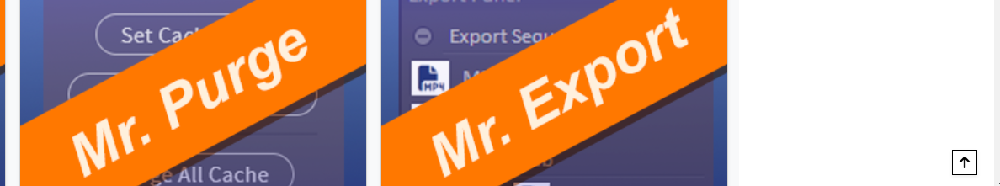
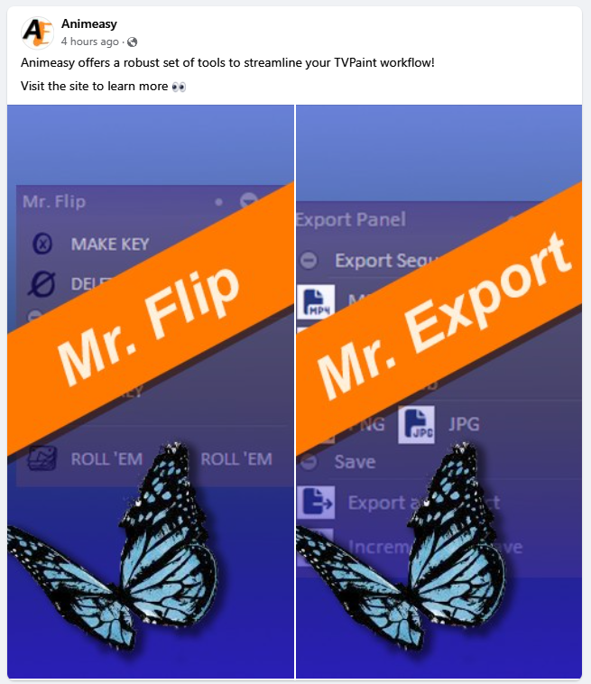
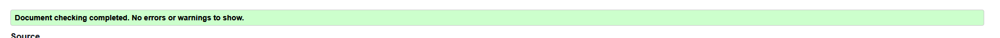
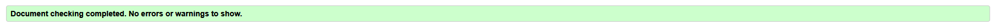

# Animeasy Tools E-commerce Site

## Overview

Animeasy is an e-commerce store that provides small software plugins for animation production. 
This README provides an overview of the ecommerce app, including its purpose, features, installation instructions, usage guidelines, and contact information.

## Purpose
The purpose of the ecommerce app is to provide users with a platform to browse, purchase, and manage digital products online. It aims to streamline the shopping experience for customers and simplify product management for sellers.
Animation is a costly and time consuming business. With the advent of digital animation it is largely created using computer programmes. This means that professionals can browse the web for plugins that may help them. 
In my animation career, I starte out using plugins purchased or developed by the studio, but over time I started to develop my own for more specific uses. 

## Features
### User authentication: Allow users to register, login, and manage their accounts.

- Users can make purchases without making an account, but they can make an account if they want to

- Returning users can log into their account 

- Users can reset their password to recover their account if they forget 
- Users can delete their account. The initial click disables the button and confirms the action, in case they clicked it by accident 

### Profiles 
- Users can view their information from their profile page 

- If no user information exists yet, the information section reads "none"

- Users can change their information from their profile page 

- User's order history is saved at the bottom of their profile 
- If the user has no order history, this is reflected back to them 

- User's support tickets and the replies can be accessed from the profile page 

### Product browsing: Enable users to search, filter, and view products.

- Users can see all products in Animeasy store in one place 

- Users can sort products by category, depending on which software they're looking for 

- Users can search for products by title or key word 

- A product detail page is available for each product 
- The product detail page displays a product description, the software category and any user reviews 

- Users can add multiples of a product to their bag from the product detail page 

- Users can sort returned products by certain characteristics using the filter dropdown 

- A back to top button scrolls the user back to the top of the page when clicked 

### Shopping cart: Allow users to add and remove items from their cart.

- Users can add a product to their bag
- The items in a user's cart are displayed in a dropdown from the nav bar, so users can see what's in their cart and the total at all times 

- Users can view their bag and see the items inside 
- Users can add or remove items from their bag from the cart view 
- If there's more than one of an item in the cart, users can see the subtotal of that item
- Users can see the total of their bag 
- Users can proceed to the checkout form from the bag view 

### Checkout process: Guide users through a secure checkout process.
- Users can securely checkout  items in their bag 
- Billing information is collected 
- Registered users can choose to save their details from next time 
- A secure checkout using Stripe 
- On comfirmation of order, users are directed to a success page, showing them their details, charge and what they ordered

### Order management: Enable users to track their orders and view order history.
- From their profile, users can see their order history 

- Clicking on the order number brings them to the original checkout success page, with a message saying that this is an old order they are viewing 

- Non registered users can access this information from their order confirmation email in their inbox 

### Admin permissions: Product management from the frontend.

- If the logged in user is a superuser, the admin panel will appear in the navigation bar

- Admin can use this panel to add products

- If the user forgets to upload an image, the default image is displayed

- Superusers can edit a product from the all products page

- Superusers have access to the product management panel from the product detail page 

- Products can be edited from the edit product view

- Products can be deleted. On clicking the delete button, a modal confirms that this is the action you want to take before deleting the product

### Newsletter 

- Users can subscribe to the Animeasy newsletter from the home page. This email collector also checks if an email is already registered and will not collect duplicates 
 

- Users can unsubscribe by entering the email they wish to unsubscribe into this form. The form can be accessed in the footer and in future versions will be included at the end of each newsletter 

- Admins can create a newsletter from the admin panel 

- Admins can create a newsletter using the newsletter form 

- On creation of newsletter, the admin is brought to a newsletter success page. This shows them the content of the email and a list of current subscribers at the bottom of the page 

- Admins can access an archive of past newsletters using the newsletter archive in the admin panel 

- Newsletters arrive in the inbox of emails that are subscribed to the newsletter 

### Contact form: Allows customers to send complaints and tracks them in an admin panel 
- Users can contact Animeasy with any queries or complaints using this form 

- The form collects the subject, content and email address of the ticket. The user is directed to a success page and a copy of the complaint is sent to their email 

- The ticket is passed into a view that only the admin can see, where all tickets are stored and their status is displayed 

- Admins can access a dashboard to views tickets and choose one to reply to 

- Tickets can be filtered by their characteristics 

- In the ticket detail view, admin can see the content of the ticket and write a reply 

- Once a reply is sent, the ticket status changes from "pending" to "resolved" 

- The reply and any susequent replies are displayed in the ticket detail page 

- Emails and replies chain up in the inbox of the person who sent the contact form 

## Deployment

To install and run the app locally, follow these steps:

- Clone the repository: git clone [repository-url]
- Navigate to the project directory: cd animeasy
- Install dependencies: <code> pip install -r requirements.txt  </code>
- Set up environment variables: Create a .env file and add necessary configuration variables. 
- Run the app: <code> python3 manage.py runserver</code >

### Usage
Once the app is running, users can access it through a web browser. They can perform the following actions:

- Register a new account or login with existing credentials.
- Browse products by category or search for specific items.
- Add products to the shopping cart and proceed to checkout.
- View and manage orders in the user account dashboard.
- Sellers can log in to the seller dashboard to manage products and orders.
- Administrators can access the admin panel to manage users and system settings.

## Agile method
###  User Stories 

I added the following user stories to my kanban board
<ul> 
    <li>
    <strong>User Story 1: User Registration</strong>
            <ul>
                <li>
                    As a customer of the Animeasy, I want to be able to create an account where I can access information about my previous purchases and opt in to promotional emails and updates about projects, along with special offers.
                </li>
            </ul>
        </li>
    <li>
    <strong>User Story 2: Products</strong>
        <ul>
            <li>
            As a potential customer of Animeasy, I want to see what products are available to purchase
            </li>
        </ul>
    </li>
    <li>
    <strong>>User Story 3: Purchasing/Cart</strong>
        <ul>
            <li>
            As a customer, I can purchase items from Animeasy
            </li>
        </ul>
    </li>
    <li>
    <strong>User Story 4: Navigation</strong>
    </li>
    <ul>
        <li>
        As a potential customer of Animeasy, I want to easily explore and find products on the site
        </li>
    </ul>
    <li>
    <strong>User Story 5: User Profile</strong>
    </li>
    <ul>
        <li>
        As a user, I can create a profile that allows me to purchase items easily
        </li>
    </ul>
    <li>
    <strong>User Story 6: Review</strong>
    </li>
    <ul>
        <li>As a customer of Animeasy, I want to be able to leave reviews on products I have purchased to share my experience with other users.
        </li>
    </ul>
    <li>
    <strong>User Story 7: Admin Permissions</strong>
    </li>
    <ul>
        <li>
        As a store owner, I can add, edit or delete products
        </li>
    </ul>
    <li>
    <strong>User Story 8: Newsletter</strong>
    </li>
    <ul>
        <li>
        As a marketer of animeasy, I want to be able to reach out to my interested leads with offers and announcements of new products via email.
        </li>
    </ul>
    <li>
    <strong>User Story 9: Contact Form</strong>
    </li>
    <ul>
        <li>
        As a seller, I would like a place to handle any issues from my customers
        </li>
        <li>
        As a customer, I would like a place to contact the seller should the need arise
        </li>
    </ul>
    <li>
    <strong>User Story 10: SEO & Marketing</strong>
    </li>
    <ul>
        <li>
        As a potential customer, I would like to be able to find Animeasy when I search for ways to make my animation workflow faster
        </li>
        <li>
        As a seller, I would like to reach more people who might benefit from using my products
        </li>
    </ul>
    <li>
    <strong>User Story 11: Help and FAQs</strong>
    </li>
    <ul>
        <li>
        As a customer of Animeasy, I would like to be able to access an install guide for my new products
        </li>
    </ul>
</ul>

### Kanban Board 
- Created an issue for each user story 
- Created issues for other tasks, like "Extras" and "Testing"
- Extras are tasks that would improve Animeasy but not essential to it's core functions
- Labelled user stories as Must Have, Could Have or Won't Have
- Testing is labelled as "Testing"
- Extras are labelled as "Could Have" 
- Main features are labelled as Must Have 
- Extras for each section are separated out into their own issues and marked as Could Have
- Each user story has a checklist of Acceptance Criteria and Tasks

#### Kanban Board Gallery

## AWS Integration
- This project uses Amazon Web Services to serve static files and images
- I used S3 for serving static files and images to the Heroku app. 

- An IAM allows the site to post into the database 

- I went over my usage costs when I had automatic deployments on 

## GDPR 

## Marketing 
### Email marketing 

For my marketing strategy I chose email. 

Because of my past experience with social media marketing, I know that the social media I would typically run a successful campaign on (Instagram and Tiktok) will not have the market I'm targeting. Animeasy is designed as a B2B business, where the desired customers would be animation studios and freelance professionals looking to speed up their workflow. 

For professionals, the better strategy is to target email inboxes. Professionals in animation cannot afford not to check their inboxes for both current client correspondence and potential offers, so this is where Animeasy would be most likely to grab their attention. The value proposition of Animeasy is also not something that would "pop" in a social media setting. Marketing in the animation field generally consists of behind-the-scenes or sizzle reels. The tedious animation process is left out. Animeasy needs to target professionals who know the real problems they may face in the animation pipeline, not the fans of the product. 

### Facebook Page 

I created a Facebook page for Animeasy. It's a business page.

To keep the page appealing, I added a cover photo of an animation desk. 

I created a custom thumbnail logo to go in the profile picture spot.

I added links to the website and some contact details. 

Finally I added a sample post, advertising the product and adding a call to action for the user to visit the site. 

The page can be found [here](https://www.facebook.com/profile.php?id=61559552969497)

### LinkedIn Page 

I followed a similar procedure to create a LinkedIn profile for Animeasy. 

LinkedIn's userbase is professionals looking to market themselves, so this fits Animeasy's target market. 

I created a very simple page for Animeasy, and populated it with the same data as the Facebook page 

[Linkedin page](https://www.linkedin.com/company/animeasy/)

## Testing 

### Manual Testing 

I did the following manual testing of Animeasy: 
| User Registration | Users can create a profile                                                     | Profile is created from registration page                                                                                      | Create a profile with animeasy                                                                                                                                                                                                                                                                                                                                                                                                                                                                                                                                                                                                                                                                                                                                                                                                                                                                                                                                                                                                                                                                                                                                                                          | A new profile is created on animeasy                                             |
| ----------------- | ------------------------------------------------------------------------------ | ------------------------------------------------------------------------------------------------------------------------------ | ------------------------------------------------------------------------------------------------------------------------------------------------------------------------------------------------------------------------------------------------------------------------------------------------------------------------------------------------------------------------------------------------------------------------------------------------------------------------------------------------------------------------------------------------------------------------------------------------------------------------------------------------------------------------------------------------------------------------------------------------------------------------------------------------------------------------------------------------------------------------------------------------------------------------------------------------------------------------------------------------------------------------------------------------------------------------------------------------------------------------------------------------------------------------------------------------------- | -------------------------------------------------------------------------------- |
|                   | Users get an email on signup                                                   | Confirm email appears in customer inbox                                                                                        | Check email inbox for confirm mail                                                                                                                                                                                                                                                                                                                                                                                                                                                                                                                                                                                                                                                                                                                                                                                                                                                                                                                                                                                                                                                                                                                                                                      | A confirmation email appears in the inbox of the account that just signed up     |
|                   | Users can log into animeasy                                                    | Users can sign into animeasy using username or email and password                                                              | Sign into animeasy using email or username and password                                                                                                                                                                                                                                                                                                                                                                                                                                                                                                                                                                                                                                                                                                                                                                                                                                                                                                                                                                                                                                                                                                                                                 | Successfully signed into animeasy using email and username and password          |
|                   | Users can log out of animeasy                                                  | User can log out successfully                                                                                                  | Log out of animeasy and check that login status is reflected in the nav bar                                                                                                                                                                                                                                                                                                                                                                                                                                                                                                                                                                                                                                                                                                                                                                                                                                                                                                                                                                                                                                                                                                                             | Logged out of animeasy, this was reflected in the nav bar                        |
|                   | Users can recover password if lost                                             | User can reset password from reset email page using email link                                                                 | Reset password using frontend and log back in                                                                                                                                                                                                                                                                                                                                                                                                                                                                                                                                                                                                                                                                                                                                                                                                                                                                                                                                                                                                                                                                                                                                                           | Reset password using frontend of site and email associated with account          |
|                   | User can delete their account                                                  | Users can delete their account and both the user and profile model are deleted                                                 | Delete a profile using the delete button on profile                                                                                                                                                                                                                                                                                                                                                                                                                                                                                                                                                                                                                                                                                                                                                                                                                                                                                                                                                                                                                                                                                                                                                     | Profile is deleted                                                               |
|                   | User is assigned a profile                                                     | Once authenticated, the use has access to a profile page with their name and details, if any                                   | Login and navigate to the Profile page                                                                                                                                                                                                                                                                                                                                                                                                                                                                                                                                                                                                                                                                                                                                                                                                                                                                                                                                                                                                                                                                                                                                                                  | Profile page is there and reflect user's information                             |
|                   | User's login status is reflected                                               | Nav bar has logout and profile links when signed in, and sign in or sign up links when not                                     | Log in and out and check for links                                                                                                                                                                                                                                                                                                                                                                                                                                                                                                                                                                                                                                                                                                                                                                                                                                                                                                                                                                                                                                                                                                                                                                      | The correct links are displayed                                                  |
| User Profile      | Empty data is handled in profile                                               | Empty billing info is displayed as"None"                                                                                       | Check new user profile to see how billing data is handled                                                                                                                                                                                                                                                                                                                                                                                                                                                                                                                                                                                                                                                                                                                                                                                                                                                                                                                                                                                                                                                                                                                                               | Empty billing data is displayed as None                                          |
|                   | User is assigned a profile on creation of account                              | Users have a profile when they log in                                                                                          | Create a new user and navigate to the profile page                                                                                                                                                                                                                                                                                                                                                                                                                                                                                                                                                                                                                                                                                                                                                                                                                                                                                                                                                                                                                                                                                                                                                      | The user is assigned a profile                                                   |
|                   | User's data is displayed in the profile                                        | If user has data, it's shown on the profile page                                                                               | Go to user profile and check for data                                                                                                                                                                                                                                                                                                                                                                                                                                                                                                                                                                                                                                                                                                                                                                                                                                                                                                                                                                                                                                                                                                                                                                   | The data is displayed on the user profile                                        |
|                   | User can update their data from the profile                                    | Users can update their data using the form on the profile page                                                                 | Update the user profile using the form on the profile page                                                                                                                                                                                                                                                                                                                                                                                                                                                                                                                                                                                                                                                                                                                                                                                                                                                                                                                                                                                                                                                                                                                                              | The changes are reflected on the user profile                                    |
|                   | If user has no orders, order section is empty                                  | The order section is empty before any orders are made                                                                          | Navigate to the user profile before any orders are made and check the order section                                                                                                                                                                                                                                                                                                                                                                                                                                                                                                                                                                                                                                                                                                                                                                                                                                                                                                                                                                                                                                                                                                                     | The order section is empty                                                       |
|                   | If user has orders, they are displayed in the orders section                   | The order section is populated with previous orders                                                                            | Create and order and check out and make sure the order appears on the profile                                                                                                                                                                                                                                                                                                                                                                                                                                                                                                                                                                                                                                                                                                                                                                                                                                                                                                                                                                                                                                                                                                                           | The orders appear on the profile                                                 |
| Testing: Linting  | Lint all HTML pages                                                            | All HTML pages pass through W3 Schools linter without any major issues                                                         | Lint all pages listed using "View Page Source" where they're rendered in the browser and correct any issues that arise bag.html checkout_success.html checkout.html contact_form.html contact_success.html contact_tickets.html privacy_policy.html terms_and_conditions.html ticket_detail.html about.html faq.html index.html install_guide.html newsletter_Archive.html newsletter_detail.html newsletter_success.html newsletter_unsubscribe.html newsletter.html delete_product_script.html quantity_input_script.html add_product.html edit_product.html product_detail.html products.html profile.html account_inactive.html base.html email_confirm.html email.html login.html logout.html password_change.html password_reset_done.html password_reset_from_key.html password_reset_from_key_done.html password_reset.html password_set.html signup.html verification_sent/hmtl verified_email_required.html toast_error.html toast_info.html toast_success.html toast_warning.html admin_panel.html footer.html navbar.html base.html   | Detailed results in Readme                                                       |
|                   | Lint all python files                                                          | Python files do not display any issues within the native gitpod/vs code linting system                                         | Go through listed python files and make sure there are no issues in the syntax Lint all pages in Animeasy   settings.py urls.py wsgi.py admin.py apps.py contexts.py models.py tests.py urls.py views.py  checkout: admin.py apps.py forms.py models.py signals.py tests.py urls.py views.py webhook_handler.py webhooks.py  contact: admin.py apps.py forms.py models.py tests.py urls.py views.py home: admin.py apps.py models.py tests.py urls.py views.py newsletter: admin.py apps.py forms.py models.py tests.py urls.py views.py products: admin.py apps.py forms.py models.py tests.py urls.py views.py widgets.py profiles: admin.py apps.py forms.py models.py tests.py urls.py views.py                                                                                                                                                                                                                                                                                               | All files working                                                                |
| Products          | Users can see all products from the products page                              | Users can see all available products on Animeasy from the "All Products" page                                                  | Go to all products page and check for all products                                                                                                                                                                                                                                                                                                                                                                                                                                                                                                                                                                                                                                                                                                                                                                                                                                                                                                                                                                                                                                                                                                                                                      | All products are there                                                           |
|                   | Users can sort products by category from the nav bar                           | Users can click on "After Effects" or "TV Paint" in the light section of the nav bar and only the correct reulsts are returned | Go to "After Effects" from the nav bar and ensure all products are After Effects.Go to TVPaint from the navbar and ensure all products are Tv Paint                                                                                                                                                                                                                                                                                                                                                                                                                                                                                                                                                                                                                                                                                                                                                                                                                                                                                                                                                                                                                                                     | The correct products are returned                                                |
|                   | Users can sort by cateogry from the search bar                                 | Users can select a category from the dropdown and the matching products are returned                                           | Enter each category into the filter div in the search bar and make sure the correct products are returned                                                                                                                                                                                                                                                                                                                                                                                                                                                                                                                                                                                                                                                                                                                                                                                                                                                                                                                                                                                                                                                                                               | Entering a key word and filter returns matching products                         |
|                   | Users can sort by key word from the search bar                                 | Users can enter a key word query in the search bar and results matching the title or description of the product are returned   | Enter a key word search term into the search bar and ensure the correct products are returned                                                                                                                                                                                                                                                                                                                                                                                                                                                                                                                                                                                                                                                                                                                                                                                                                                                                                                                                                                                                                                                                                                           | Entering a key word in the search bar returns matching products                  |
|                   | Users can navigate to the product detail page by clicking on a search result   | Users can click on a products to see more details                                                                              | Click on each product and ensure the correct detail page is returned                                                                                                                                                                                                                                                                                                                                                                                                                                                                                                                                                                                                                                                                                                                                                                                                                                                                                                                                                                                                                                                                                                                                    | Clicking on a product bring you to a detail page for that product                |
|                   | Product page displays correct information about the product                    | The information dsplayed on the product page matches that of the product                                                       | Check the information on each product page matches the information enetered in the model upon creation                                                                                                                                                                                                                                                                                                                                                                                                                                                                                                                                                                                                                                                                                                                                                                                                                                                                                                                                                                                                                                                                                                  | The information displayed on the page reflects the product                       |
|                   | Users can add a product to thei bag from the product page                      | Users can add the product to their bag from the page and it is displayed in their bag                                          | Add a product to the bag using the "Add to Bag" button and check that it appears in the bag                                                                                                                                                                                                                                                                                                                                                                                                                                                                                                                                                                                                                                                                                                                                                                                                                                                                                                                                                                                                                                                                                                             | The item is added to bag                                                         |
|                   | Users can add multiple items from the product page                             | Users can use the qunatity selector to add more than one item to their bag at a time                                           | Add multiple products to the bag using the quanitity selector div and check the correct amount of products have entered the bag                                                                                                                                                                                                                                                                                                                                                                                                                                                                                                                                                                                                                                                                                                                                                                                                                                                                                                                                                                                                                                                                         | The correct amout of items are added to the bag                                  |
|                   | User can order products by certain categorys                                   | Products are ordered on the page in the order selected in the filter dropdown                                                  | Test each option in the filter dropdown to make sure products are ordered correctly                                                                                                                                                                                                                                                                                                                                                                                                                                                                                                                                                                                                                                                                                                                                                                                                                                                                                                                                                                                                                                                                                                                     | The products appear in the correct order                                         |
|                   | Back to top button works                                                       | The back to top button scrolls the user back to the top of the page when clicked                                               | Click the back to top button after scrolling to the top of the page                                                                                                                                                                                                                                                                                                                                                                                                                                                                                                                                                                                                                                                                                                                                                                                                                                                                                                                                                                                                                                                                                                                                     |                                                                                  |
| Newsletter        | Users can subscribe to the newsletter                                          | Users are subscribed to the newsletter after entering their email in the subscribe form on the home page                       | Sign up for the email on the home page                                                                                                                                                                                                                                                                                                                                                                                                                                                                                                                                                                                                                                                                                                                                                                                                                                                                                                                                                                                                                                                                                                                                                                  | The user is subscribed                                                           |
|                   | Users can unsubscribe from the newsletter                                      | Users can unsubscribe from animeasy newsletter using the unsubscribe form                                                      | Unsubscribe from the email on the unsubscribe page                                                                                                                                                                                                                                                                                                                                                                                                                                                                                                                                                                                                                                                                                                                                                                                                                                                                                                                                                                                                                                                                                                                                                      | The user in unsubscribed                                                         |
|                   | Duplicate emails cannot subscribe to the email newsletter twice                | Users cannot sign up for the newsletter if they already are sunscribed                                                         | Try to sign up for the newsletter using an exisiting subscriber email                                                                                                                                                                                                                                                                                                                                                                                                                                                                                                                                                                                                                                                                                                                                                                                                                                                                                                                                                                                                                                                                                                                                   | The user is informed that the email already exists and the form is not submitted |
|                   | Admins can get to the newsletter form                                          | Admins can get to the newsletter form, non admins cannot                                                                       | Use the admin panel to get to the newsletter form, try to navigate to the form using HTML                                                                                                                                                                                                                                                                                                                                                                                                                                                                                                                                                                                                                                                                                                                                                                                                                                                                                                                                                                                                                                                                                                               | Only admins can access the form                                                  |
|                   | Admins can create a newsletter                                                 | Admins can create a newsletter using the newsletter form                                                                       | Create a newsletter using the newsletter form                                                                                                                                                                                                                                                                                                                                                                                                                                                                                                                                                                                                                                                                                                                                                                                                                                                                                                                                                                                                                                                                                                                                                           | Newsletter success page, newsletter has been created                             |
|                   | Email newsletters are delivered to the inboxes of subscribers                  | The inbox of a subscribed email receives a newletter                                                                           | Sent a newsletter and check a subscriber's email inbox to make sure that it arrived                                                                                                                                                                                                                                                                                                                                                                                                                                                                                                                                                                                                                                                                                                                                                                                                                                                                                                                                                                                                                                                                                                                     | Newsletter arrives in inbox                                                      |
|                   | Emails are populated with the content of the create newsletter forms           | The content of the email matches what was entered in the content input of the newsletter form                                  | Check the content of the delivered newsletter and make sure it matches what was entered when creating the newsletter                                                                                                                                                                                                                                                                                                                                                                                                                                                                                                                                                                                                                                                                                                                                                                                                                                                                                                                                                                                                                                                                                    | Newsletter content matches what was entered into the form                        |
|                   | Admins can see an archive of all past newsletters                              | The newsletter archive shows a list of past newsletters                                                                        | Check the newsletter archive page to make sure created newsletters are appearing                                                                                                                                                                                                                                                                                                                                                                                                                                                                                                                                                                                                                                                                                                                                                                                                                                                                                                                                                                                                                                                                                                                        | Newsletters are appearing in archive                                             |
|                   | Admins can click on a newsletter title and see the content of past newsletters | Clicking on a newsletter in the archive brings the user to a page with the full content of the email                           | Click on a newsletter to make sure the newsletter detail page is displayed and populated with the correct information                                                                                                                                                                                                                                                                                                                                                                                                                                                                                                                                                                                                                                                                                                                                                                                                                                                                                                                                                                                                                                                                                   | Clicking on a newsletter reveals the full title and content of the newsletter    |
| Contact           | Users can navigate to a contact form                                           | Anyone regardless of sign in or superuser status can access the contact form                                                   | Click on support to go to the contact form                                                                                                                                                                                                                                                                                                                                                                                                                                                                                                                                                                                                                                                                                                                                                                                                                                                                                                                                                                                                                                                                                                                                                              | User is brought to the contact form                                              |
|                   | Users can send a complaint                                                     | The form being filled out and submitted redirects the user to a contact success page with the contents of the complaint        | Send a complaint using the contact form                                                                                                                                                                                                                                                                                                                                                                                                                                                                                                                                                                                                                                                                                                                                                                                                                                                                                                                                                                                                                                                                                                                                                                 | Complaint success page, complaint has been posted successfully                   |
|                   | The complaint the user sent arrives in their email inbox                       | The user receives an email of their complaint in their inbox                                                                   | Send a complaint using the form and check the inbox of the supplied email to make sure a copy of the complaint arrived in the inbox                                                                                                                                                                                                                                                                                                                                                                                                                                                                                                                                                                                                                                                                                                                                                                                                                                                                                                                                                                                                                                                                     | The complaint arrives in the inbox of the supplied email                         |
|                   | The complaint appears in the ticket form overview                              | An admin can see each complaint arrive in the contact tickets view page                                                        | Check the list of contact tickets and ensure the complaint is stored there                                                                                                                                                                                                                                                                                                                                                                                                                                                                                                                                                                                                                                                                                                                                                                                                                                                                                                                                                                                                                                                                                                                              | The ticket arrives in the ticket view                                            |
|                   | Admins can click on a ticket to view its details                               | Clicking on a ticket brings the admin to the contact detail page                                                               | Click on each ticket in the contact overview and make sure the correct detail page is displayed                                                                                                                                                                                                                                                                                                                                                                                                                                                                                                                                                                                                                                                                                                                                                                                                                                                                                                                                                                                                                                                                                                         | Clicking on a ticket brings the admin to the ticket detail page                  |
|                   | Admins can reply to a ticket from the ticket detail page                       | Admins can write a reply to the ticket in the reply form and save it                                                           | Reply to a ticket using the ticket reply form                                                                                                                                                                                                                                                                                                                                                                                                                                                                                                                                                                                                                                                                                                                                                                                                                                                                                                                                                                                                                                                                                                                                                           | Reply is sent successfully                                                       |
|                   | Ticket replies are shown under the ticket on the ticket detail page            | Each reply to a ticket is stored underneath the original complaint                                                             | Make a couple of replies to a ticket and make sure they are displayed beneath the original complaint in the detail page                                                                                                                                                                                                                                                                                                                                                                                                                                                                                                                                                                                                                                                                                                                                                                                                                                                                                                                                                                                                                                                                                 | All replies are stored below the ticket                                          |
|                   | TIckets are set from pending to resolved when they have a reply                | On submitting the reply form, the ticket status reflected in the ticket overview page is set from "pending" to "resolved"      | Reply to a ticket and check the status on the ticket overview page                                                                                                                                                                                                                                                                                                                                                                                                                                                                                                                                                                                                                                                                                                                                                                                                                                                                                                                                                                                                                                                                                                                                      | The status is changed from "pending" to "resolved"                               |
|                   | Tickets can be filtered using the filter dropdown                              | Each option in the filter returns the tickets in the correct order                                                             | Click on each filter in the filter dropdown and make sure tickets are sorted in the correct order                                                                                                                                                                                                                                                                                                                                                                                                                                                                                                                                                                                                                                                                                                                                                                                                                                                                                                                                                                                                                                                                                                       | Tickets are filtered according to the dropdown                                   |
|                   | Ticket replies are sent to the person who contacted                            | A reply is sent to the inbox of the person who sent the original ticket                                                        | Reply to a ticket and check the inbox of the original complaint email to make sure a reply arrived                                                                                                                                                                                                                                                                                                                                                                                                                                                                                                                                                                                                                                                                                                                                                                                                                                                                                                                                                                                                                                                                                                      | A reply has arrived in the inbox                                                 |
|                   | Ticket replies are collected in the email chain under the complaint            | Each reply to a ticket is stored in a chain in the inbox of the email                                                          | Send some replies and check the email inbox to make sure the replies are stacked under the original complaint email in a chain                                                                                                                                                                                                                                                                                                                                                                                                                                                                                                                                                                                                                                                                                                                                                                                                                                                                                                                                                                                                                                                                          | The reply is in the same email chain as the complaint                            |
### Linting 

The following is the results from the [W3 Schools HTML validation service](https://validator.w3.org/)

About Page

Add Product 

This error is caused from the image thumbnail uploader. It needs to have a duplicate ID to work with the custom scripting/styling

Same error as the add product page

Bag

Checkout 

HTML does not like the "empty" h3 heading that the loading spinner is under.

Checkout Success

Contact Form

Contact Success

Contact Tickets

Edit Product

FAQ

Home page

Installation Guide

Newsletter Archive

Newsletter Detail

Newsletter Success

Newsletter Unsubscribe 

Newsletter Creator 

Privacy Policy

Product Detail

Products

Profile

Terms and Conditions

Contact Ticket Detail 

## Future Features 
### Reviews 
- In the future, I would like to let users enter reviews of the product. The product model is set up with a rating system in anticipate adding this in the future.
- Users could rate the products by giving them a start rating 
- Reviews written about the product would be written below the project 

### File Downloads
- I would like to send users a link to download their purchased files 
- Animeasy would generate a token to prevent fraud 
- The link would be sent in the confirmation email 

## Known Issues 
### Email Styling 
- The contact emails do not have "Reply to ticket (Ticket Number)" in the subject 
- Contact emails are not styled in the body 
- Newsletters are sent as a block of text. In the future they should have rich text styling
- Newsletters should have the unsubscribe link at the bottom 

### Ordering 
- Newsletters are not automatically sorted by newest
- Contact tickets are not automatically sorted by newest 

### User Experience 
- If a user submits a ticket, the site should check for a matching email in users and attach the ticket to their account 
- This could then be accessed from an extra tab labelled "My Tickets" in the user profile
- I had to remove the country dropdown as django-countries was breaking my webhook. After talking to tutor support for hours, it was removed. The user now has to enter their country by typing a two letter code. 
- If there's more that 5 items in their bag, the list will be truncated and an " ... & more" will be displayed

### Webhooks 
- Webhooks sometimes don't send right away, and deliver overnight. 
- They don't play nicely with browser and cookie cache, so if you're having issues clear them and try again 
## Contact
For any questions, feedback, or support issues, please contact me at carlalennon@gmail.com .

## Sources: 
https://www.youtube.com/watch?v=hWtlskOaFNI newsletter
https://www.grokcode.com/819/one-click-unsubscribes-for-django-apps/ Unsubscribe
Linter HTML https://validator.w3.org/
#